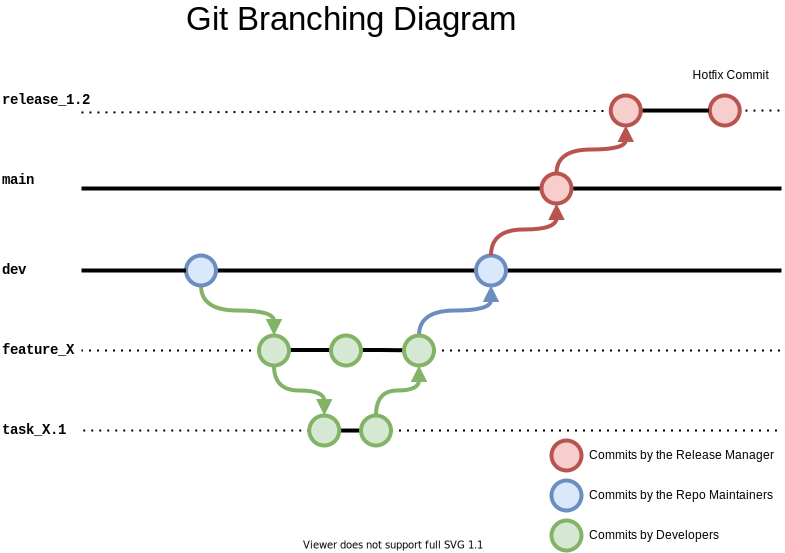

## Table of Contents
{:.no_toc}

* Contents
{:toc}

{:width="100%"}

## main branch

This branch follows the company's public **release schedule**. Everything on this branch is **official**, so any commit landing here must have been validated by a **release manager**.

Official releases are marked either using **git tags** or **release branches**.

When ready, the `dev` branch is merged into the `main` branch by the release manager.

## dev branch

Commits in this branch have undergone Quality Assurance (QA), they pass unit tests and code style linting. To ensure all this, only the **repository maintainers** have commit rights into this branch.

Code lands on this branch via GitHub Pull Requests (PR) from `feature` branches.

## feature branches

Each branch deals with a **single feature**. They depart from the `dev` branch and go back to it via a PR, ensuring it is peer reviewed and it passes QA, unit tests and code style linting.

Commit early / commit often principle. No special commit message format is enforced in this branch.

Before submitting a PR for merging into `dev`, commits in a feature branch shall be **rebased** to the current `HEAD` and **squashed** into one or several **properly formatted commits** (See [Commit Discipline](commit-discipline.md)).

Feature branches should be deleted after merging them back into `dev`.

## task branches (optional)

When features are big enough they can be **divided into tasks**.

`task` branches depart from and, later, merge into their corresponding `feature` branch after peer review.\
Commit early / commit often principle. No special commit message format enforced.

## release branches (discussion ongoing)

Fork from `main` branch.\
Hotfixes are applied to `release` branches by release managers after peer review.